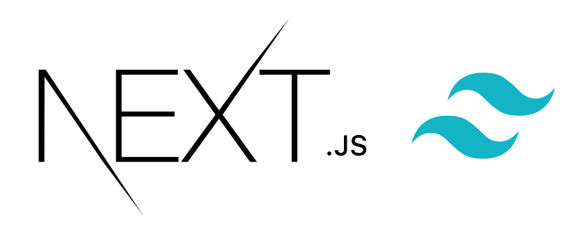

<div align="center">
  
</div>

This is a [Next.js](https://nextjs.org/) and [Tailwind CSS](https://tailwindcss.com/) starter kit. It's fully optimized
for the utmost performance.

- [Next.js](https://nextjs.org/)
- [Tailwind CSS](https://tailwindcss.com/)
- [PostCSS](https://postcss.org/)
- [PurgeCSS](https://purgecss.com/)
- [cssnano](https://cssnano.co/)
- Deployed with [Vercel](https://vercel.com/)

<br>
<hr />
<br>

<div align="center">
  
</div>

<br>
<hr />
<br>

## Getting Started

First, clone—or download— the project to install the dependencies:

```bash
bun install
```

Then, run the development server:

```bash
bun dev
```

Open [http://localhost:3000](http://localhost:3000) with your browser to see the result.

To build a production bundle, run:

```bash
bun build
```

## Contributing

Contributions are welcome!

1.  Fork it.
2.  Create your feature branch: `git checkout -b my-new-feature`.
3.  Commit your changes: `git commit -am 'Adds some feature'`.
4.  Push to the branch: `git push origin my-new-feature`.
5.  Submit a pull request.

Or open [an issue](https://github.com/suyalcinkaya/nextailwind/issues).
